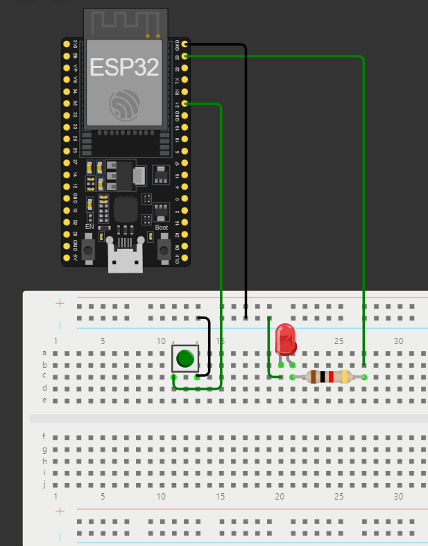
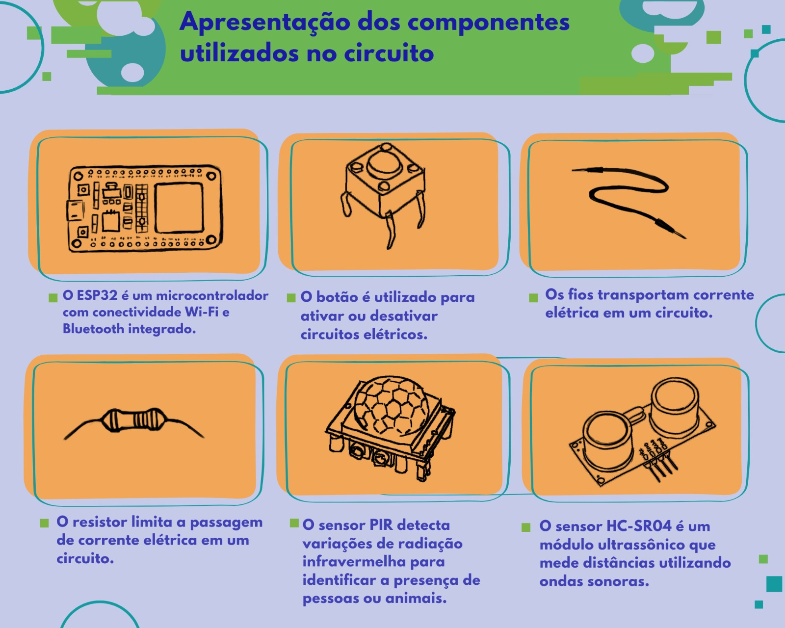

# MalocaHandsOn_Grupo06_Aula03  
## Equipe 06  
- *Daniel Silva*  
- *Gilberto Alexsandro*  
- *Guilherme Miranda*  

---

# Desafio Monitorado: Integração de Sensores PIR e HC-SR04 com Botão  

Este projeto, desenvolvido no contexto do *Projeto Maloca das iCoisas*, tem como objetivo criar um sistema monitorado que combina o sensor PIR, o sensor de proximidade HC-SR04 e um botão. A lógica programada verifica movimentos e distâncias, exibindo mensagens específicas no monitor serial do Arduino para alertar sobre a presença de objetos próximos ao dispenser.  

Foi utilizado o *Wokwi* para simulação e validação do circuito, além de testes realizados em sala de aula para garantir a funcionalidade.  

---

## Esquema de Conexão  
O circuito integra o sensor PIR, o sensor HC-SR04 e um botão. O diagrama esquemático foi desenvolvido na *plataforma Wokwi*.  

  

🔗 *Acesse a simulação completa no Wokwi aqui:*  
[Simulação no Wokwi](https://wokwi.com/projects/416627021552970753)

---

## Big Picture  
A *Big Picture* do projeto apresenta os objetivos principais, destacando:  
- Detecção de movimento pelo sensor PIR.  
- Verificação da proximidade com o sensor HC-SR04, a uma distância *d* configurável.  
- Exibição de mensagens no monitor serial com base nas condições detectadas.  

---

## Melhorias Implementadas  
- *Integração dos sensores PIR e HC-SR04 com o botão:*  
  - O sistema detecta movimento pelo sensor PIR.  
  - Verifica se algo está dentro da distância configurada *d* pelo sensor HC-SR04.  
  - Exibe mensagens no monitor serial:  
    - "Movimento detectado" se o PIR for ativado.  
    - "Algo está próximo: X cm" se algo estiver a uma distância menor ou igual a *d*.  
    - "Nada próximo ao dispenser" se a distância for maior que *d*.  

🔗 O código está disponível no arquivo:  
*Código.ino*

---

## Tecnologias Utilizadas  
- *Wokwi* - Para simulação do circuito.  
- *Arduino IDE* - Para desenvolvimento e validação do código.  

---

## Estrutura do Repositório  
Circuito.png*: Imagem do diagrama esquemático.  
- *BigPicture.jpg*: Representação visual dos objetivos do projeto.  
- *Código.ino*: Código-fonte da integração dos sensores com a lógica implementada.  

